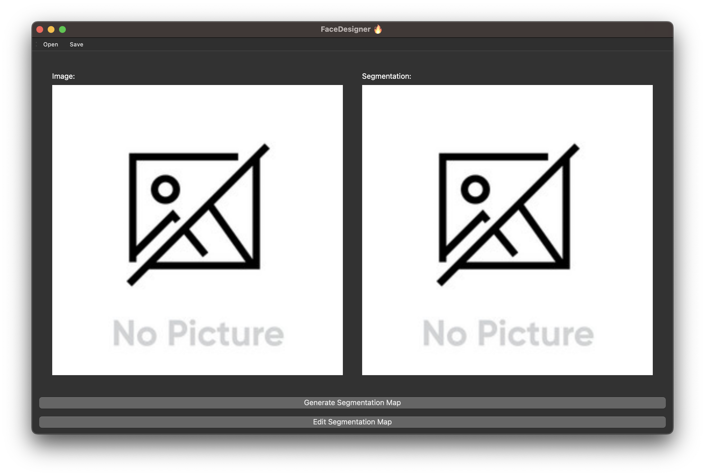
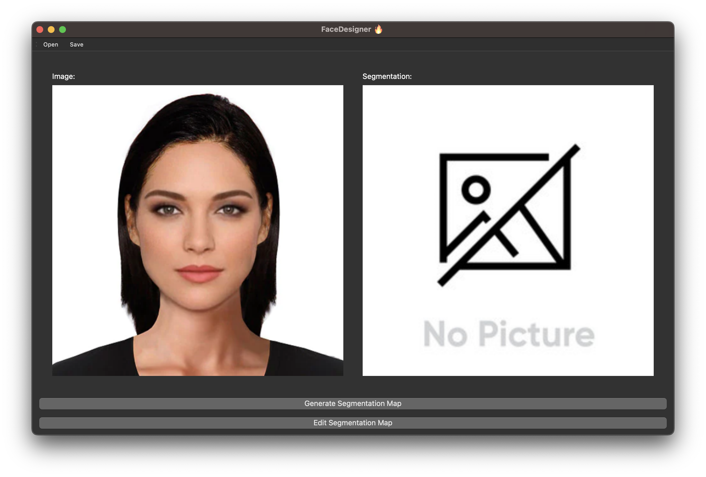
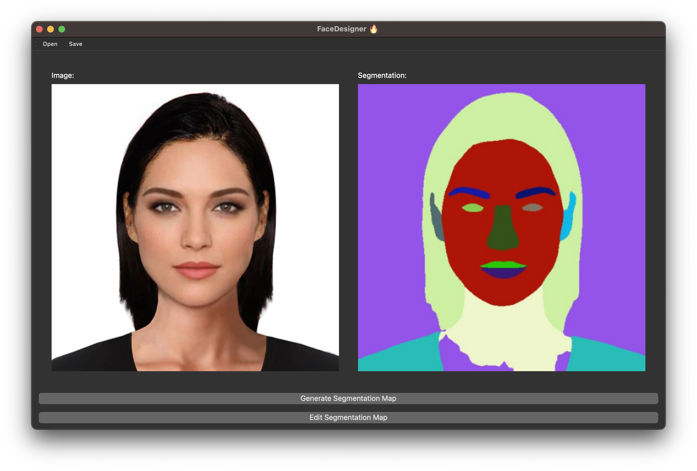

## Prerequisites
Application largely depends on Python3.10 and all other prerequisites are located in the requirements.txt.

# How to setup application?
TBD

# Usage

## Segmentation
To segment our face you can use application in the following way:
1. In the upper toolbar you can see "Open" button. Using it you can search for an image of face through your filesystem.

2. Now click button "Generate Segmentation Map" located under both images.

3. See the results!

# :warning: TODO:
TBD